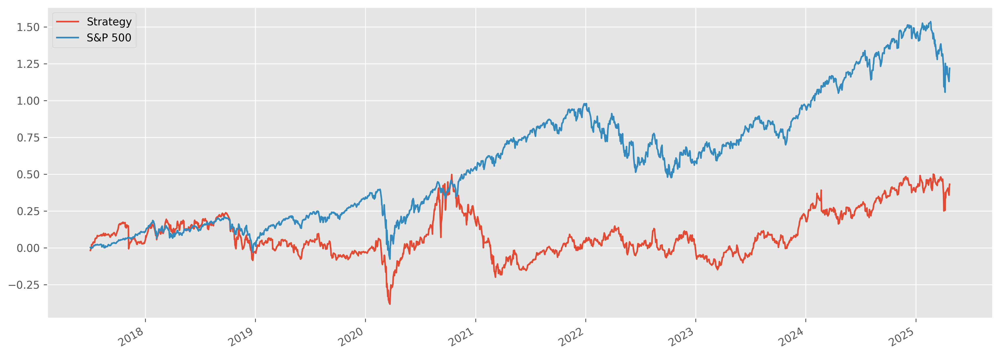

# 📈 Unsupervised Learning Trading Strategy

This repository contains my end-to-end **quant research pipeline** combining unsupervised learning, factor models, technical indicators, and portfolio optimization to test systematic stock selection on the **S&P 500**.

---

## 🚀 Project Overview

**Goal:** Build a pipeline that:
- Clusters stocks by technical + fundamental features.
- Selects promising clusters monthly.
- Optimizes portfolio weights to maximize Sharpe ratio.
- Handles real-world constraints like missing data and infeasible optimizations.
- Benchmarks daily returns vs. the S&P 500.

---

## 📂 Pipeline Highlights

### ✅ Data
- **Source:** Daily OHLCV for all S&P 500 tickers via `yfinance`.
- **Benchmark:** Fama-French 5-Factor model from `pandas_datareader`.

---

### ✅ Feature Engineering
- **Technical Indicators:**  
  - ATR (Average True Range)  
  - RSI (Relative Strength Index)  
  - Bollinger Bands  
  - MACD  
  - Garman-Klass Volatility  
- **Factor Betas:** Rolling 12-month OLS regression for dynamic market betas.

---

### ✅ Unsupervised Learning
- **Clustering:** KMeans clusters stocks each month using standardized technical/factor features.
- **Selection:** One target cluster is chosen to form the candidate portfolio for the next month.

---

### ✅ Portfolio Construction
- **Optimizer:** `PyPortfolioOpt` maximum Sharpe ratio, with **Ledoit-Wolf covariance shrinkage** for stability.
- **Fallback:** If optimization fails or there’s not enough data, the portfolio uses **equal weights**.
- **Daily Returns:** Weighted daily returns are aggregated and compared to the benchmark.

---

## 📊 Results

Below is a snapshot comparing the **cumulative returns** of the strategy vs. the S&P 500:

---

## ✅ What Works

- End-to-end **data to backtest** pipeline is automated and robust.
- Handles edge cases like **sparse or missing data**, optimizer failures, and unstable covariances.
- Shows how **unsupervised learning** can be combined with factor models and classical portfolio theory.

---

## ⚠️ What Needs Work

- The strategy’s **cumulative return underperforms** the S&P 500.
- Clusters do not consistently select outperformers — needs better **feature selection**, cluster validation, or macro overlay.
- The fallback equal weights dilute edge — better heuristics could help.

---

## 💡 Next Steps

- Try other clustering techniques (GMM, DBSCAN).
- Add **regime detection** to adjust cluster usage.
- Use supervised learning to guide cluster labels.
- Add **transaction costs** and realistic constraints.
- Refine fallback logic with smarter heuristics.

---

## 📌 Key Takeaways

- **Unsupervised methods** in trading need strong domain knowledge — clustering alone won’t guarantee alpha.
- **Robust quant engineering** means planning for real-world data gaps and infeasible edge cases.
- Even a strategy that underperforms can deliver **big learning value** for research and iteration.

---

## ⚙️ Tech Stack

- **Python** (Pandas, NumPy, scikit-learn, yfinance, PyPortfolioOpt)
- **Jupyter Notebook** for prototyping
- **Matplotlib** for visualization

---

## 🤝 Let’s Connect

I’m always open to feedback, collaboration, or just talking about **quant research** and **systematic investing**. Feel free to connect on [LinkedIn](#) or open an issue!

---

**License:** MIT

